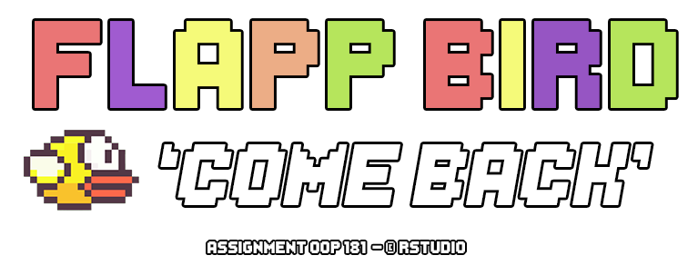
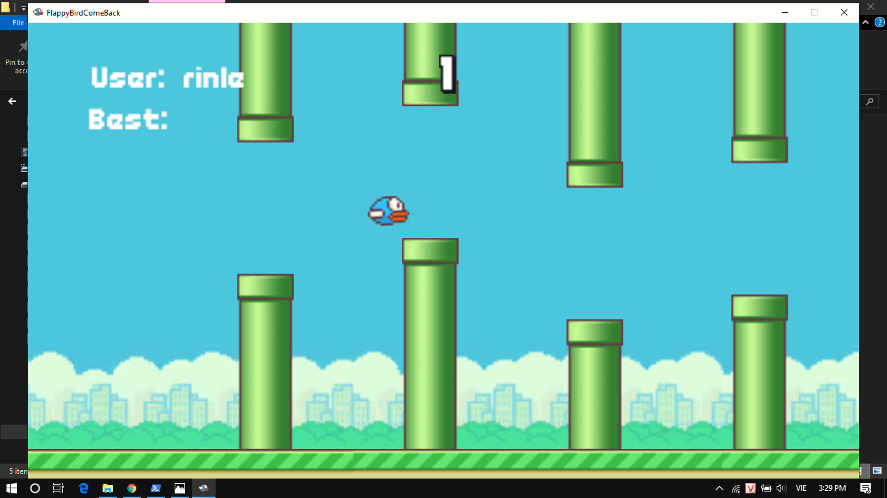

# Flappy Bird Come Back ##
## Required ##
* MongoDB
* Unity
* NodeJS
* Socket.io

# Run Game
## Start Service MongoDB
## Start Server
```
$ cd ./Server
$ node index.js
```

# Demo
* Logo

* Screen Game

* Youtube
[Youtube](https://youtu.be/NGm73ZMKsIA)

# Base on
[dgkanatsios/FlappyBirdStyleGame](https://github.com/dgkanatsios/FlappyBirdStyleGame)


